# 小程序demo

## 接入流程

参考 [小程序简易教程-起步](https://developers.weixin.qq.com/miniprogram/dev/index.html)

1. 注册
在微信公众平台注册小程序，完成注册后可以同步进行信息完善和开发。

2. 小程序信息完善
填写小程序基本信息，包括名称、头像、介绍及服务范围等。

3. 开发小程序
完成小程序开发者绑定、开发信息配置后，开发者可下载开发者工具、参考开发文档进行小程序的开发和调试。

4. 提交审核和发布
完成小程序开发后，提交代码至微信团队审核，审核通过后即可发布（公测期间不能发布）。

参考 [接入流程](https://mp.weixin.qq.com/cgi-bin/wx)。

注册分三步：首先填写基本信息。

注意：作为登录帐号，请填写未被微信公众平台注册，未被微信开放平台注册，未被个人微信号绑定的邮箱。

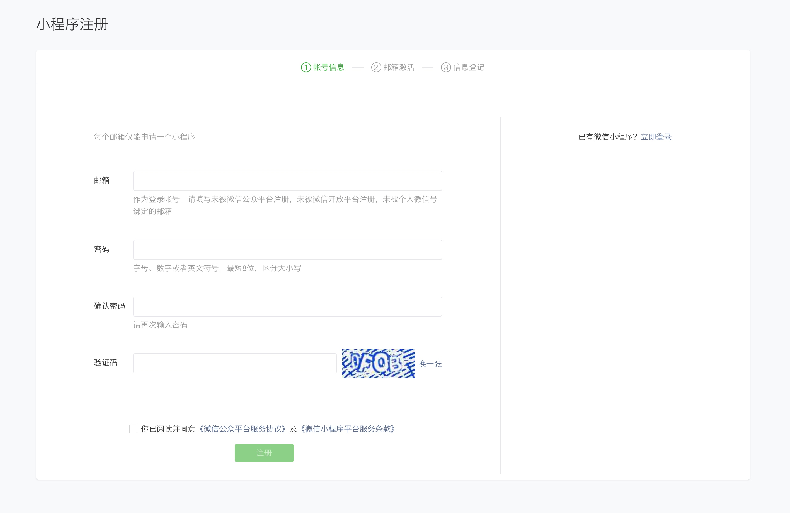

然后，去邮箱点击链接激活。

最后，登记信息。

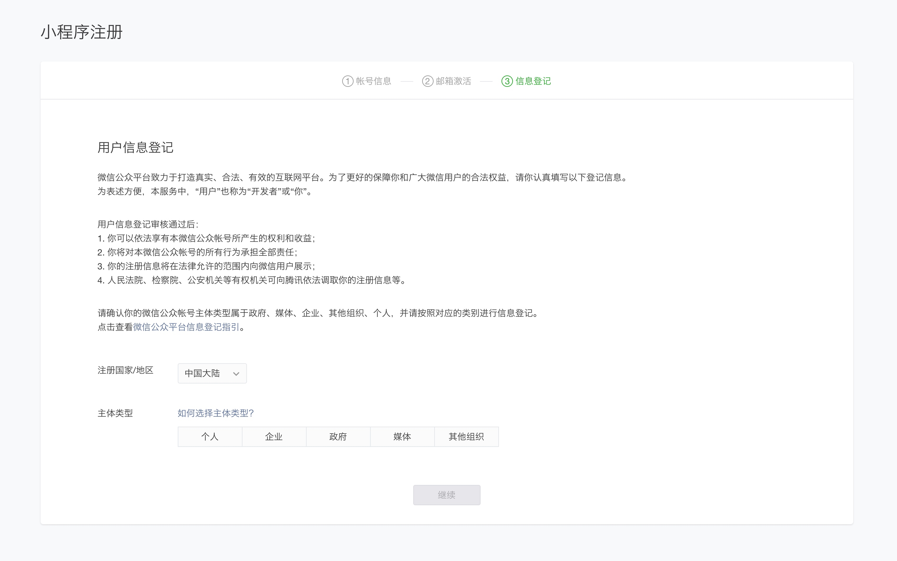

选择主体，扫码完成管理员身份认证。

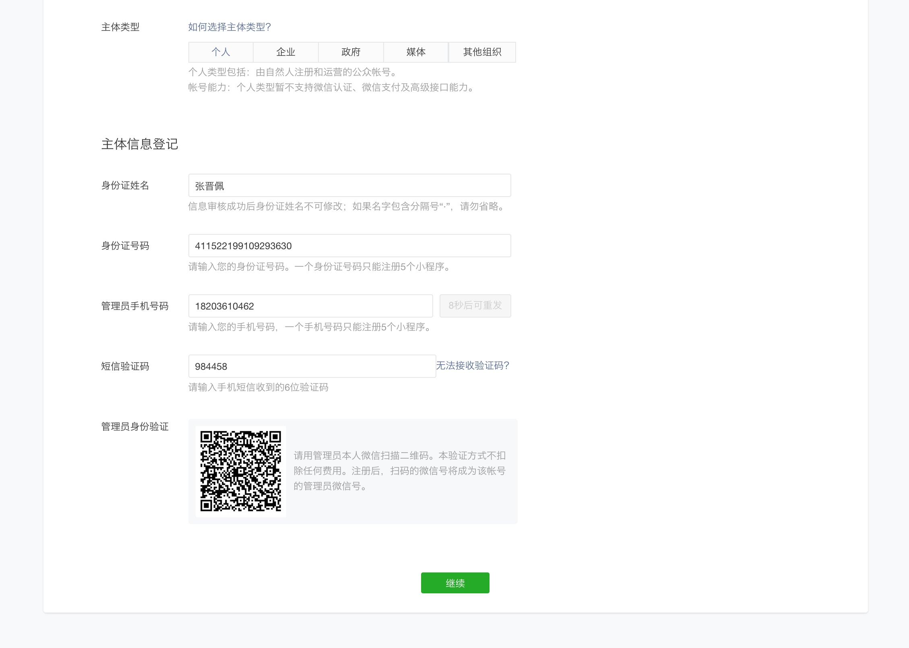

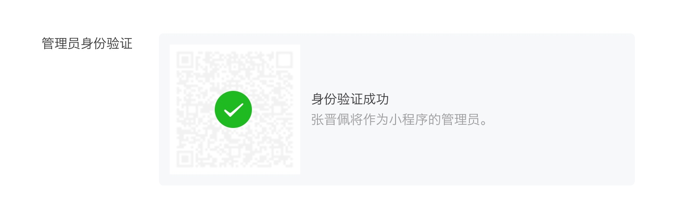

主体信息提交后，不可更改，

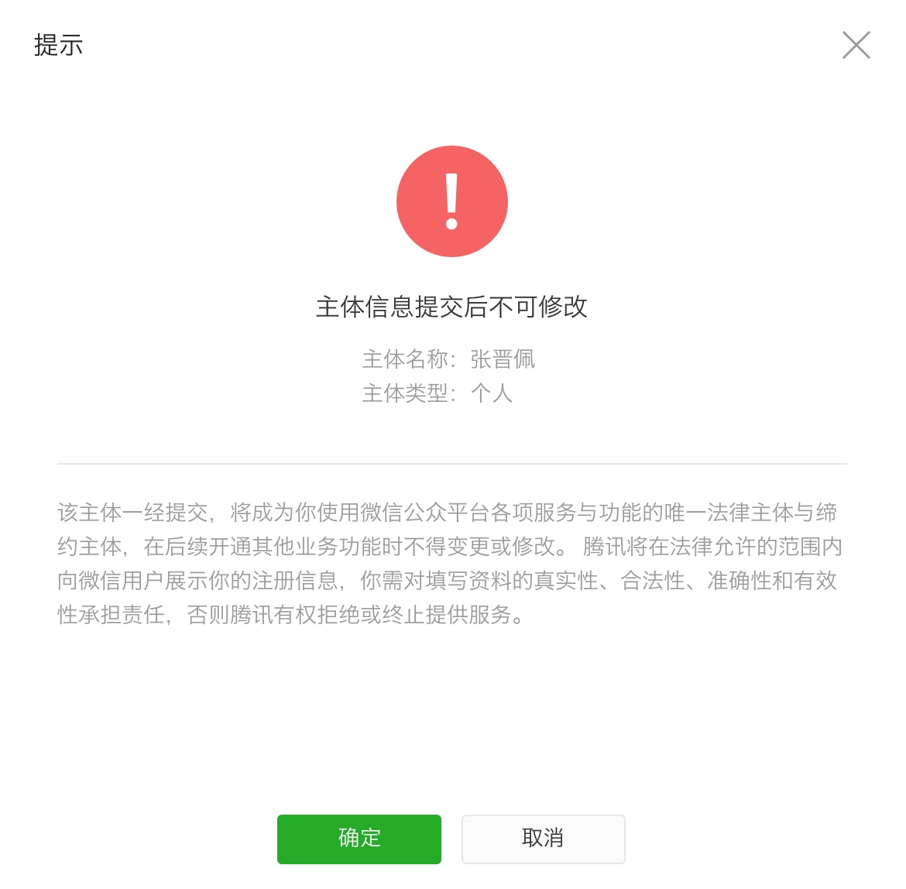

确定后，提示前往小程序。

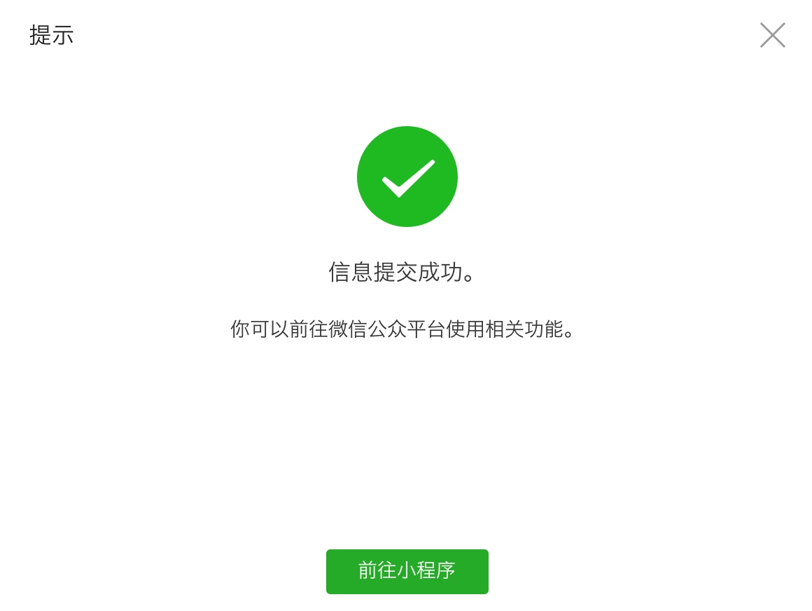

小程序后台：

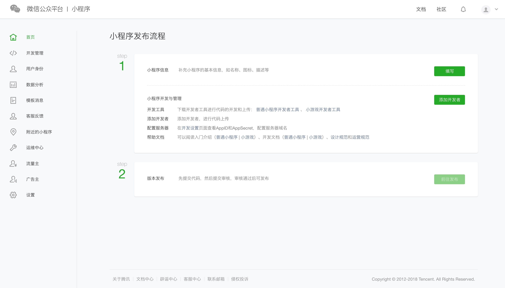

然后，在设置 - 开发设置 中 可以查看 AppID (注意这里要区别于服务号或订阅号的 AppID)，AppID 相当于小程序平台的一个身份证。

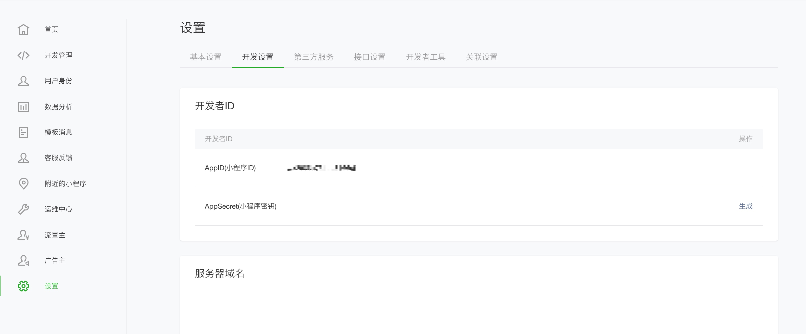

## 创建项目

创建项目之前，得先下载 [微信开发者工具](https://developers.weixin.qq.com/miniprogram/dev/devtools/download.html?t=18102320)

打开微信开发者工具，首先登陆

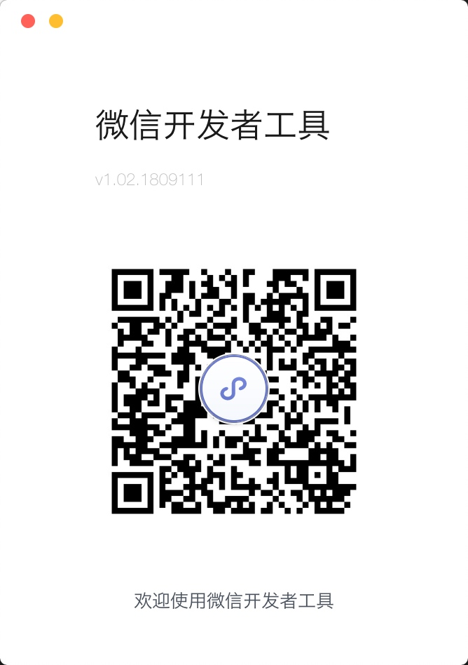

然后选择，新建 web项目，还是 小程序

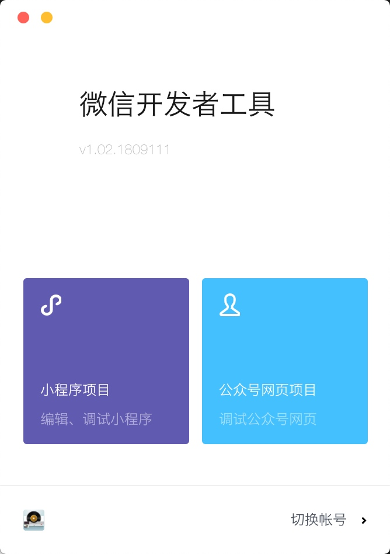

选择小程序，填入 AppID。如果是测试，点测试会自动填入AppId。

**注意**：这里选择 `建立普通快速启动模板`。还有一个是 `建立云开发快速启动模板`，云开发 与 普通开发不同点：

- 无游客模式、也不可以使用 测试号
- project.config.json 中增加了字段 cloudfunctionRoot 用于指定存放云函数的目录
- cloudfunctionRoot 指定的目录有特殊的图标
- 云开发能力从基础库 2.2.3 开始支持

点击确定，一个项目就创建好了。

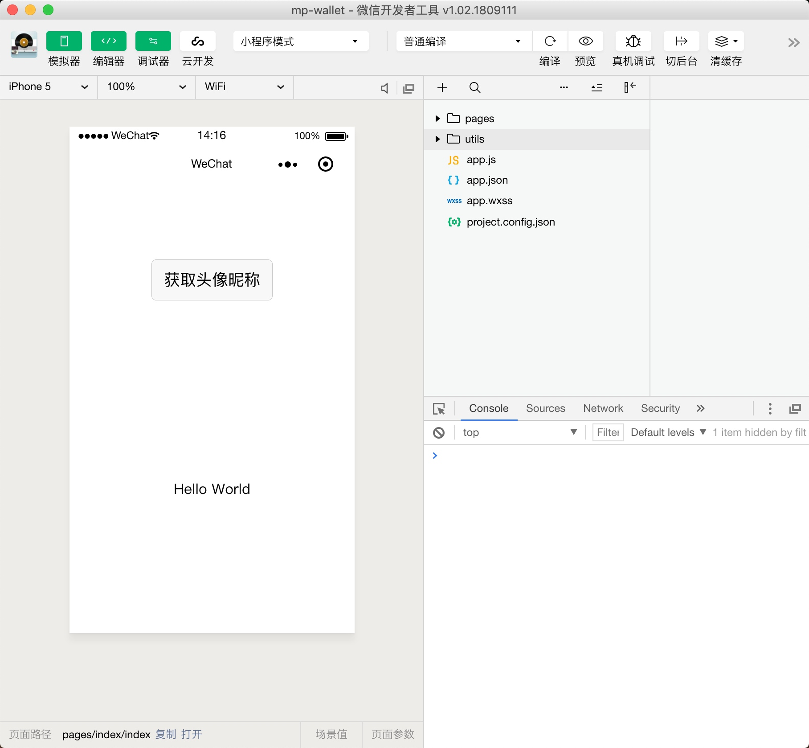

第一次进来，页面可能是空白的，点一下编译，就可以看到了。

## 技术点

[注意：在组件wxss中不应使用ID选择器、属性选择器和标签名选择器](https://developers.weixin.qq.com/miniprogram/dev/framework/custom-component/)

## 需要实践的内容

- [ ] 模板（template） 引用（import includ） 自定义组件
- [ ] 
